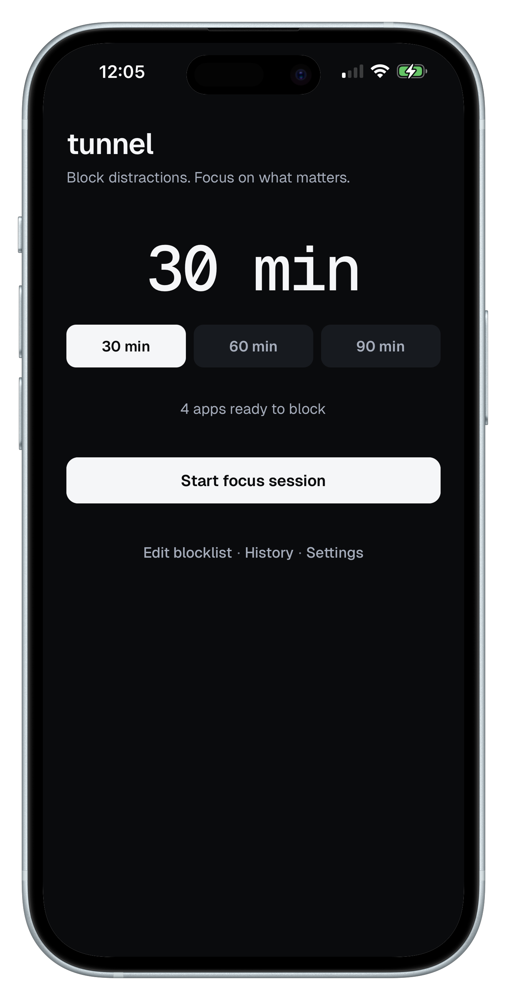
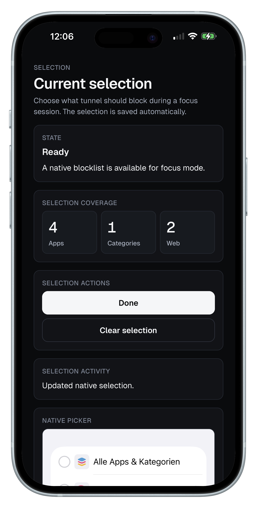
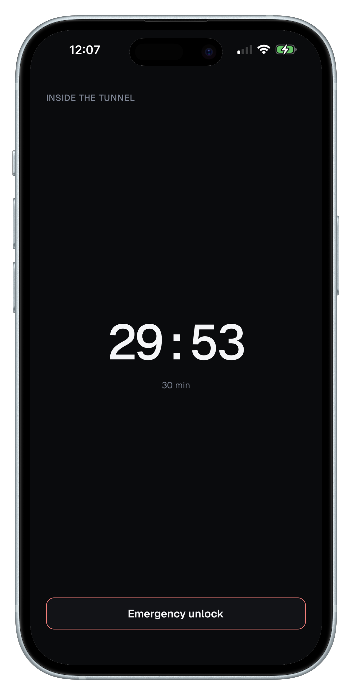

# tunnel 

** Stay focused**


tunnel is an iPhone-first productivity app built as a portfolio project to demonstrate how React Native and Swift can work together in a real native iOS feature.

It helps users block selected distractions during timed focus sessions, with intentional friction when they try to quit early.

## Preview

<p align="center">
  
  
  
 

## What it does

tunnel  helps users create focused work sessions by blocking selected distractions for a chosen duration.

During a session, the app keeps the experience intentionally simple: a countdown, a clear focus state, and an emergency unlock flow that adds friction before quitting early.

## Why this project matters

tunnel is more than a React Native UI demo. It combines a mobile interface with native Swift code to access iOS Screen Time features.

The project demonstrates working across the JavaScript/native boundary, handling platform-specific APIs, and building a complete focus-session flow from setup to history.

## Core Features

- Create timed focus sessions
- Select apps, categories, and web domains to block
- Apply native iOS shielding during active sessions
- Quit early only through an emergency unlock flow
- Add friction with hold-to-confirm, reason selection, and delay
- Save local session history

## Tech Highlights

**React Native**

- Expo app with Expo Router
- TypeScript-first implementation
- Local session state and history persistence

**Native iOS**

- Custom Swift module via Expo Modules
- Native Screen Time authorization flow
- Persistent native blocklist selection
- iOS shielding for apps, categories, and web domains

**Quality**

- Jest tests for core app logic
- Small feature-based app structure
- Clear separation between UI, services, native bridge wrappers, storage, and shared types

## Status

**Distribution-ready portfolio app.**

The app-side implementation is complete and in final testing. The repository demonstrates the full focus flow, including native iOS integration, persistent blocklist selection, timed focus sessions, emergency unlock friction, and local session history.

## Run locally

```bash
cd apps/mobile
npm install
npm run ios
```

```bash
npm test
npm run lint
```

The full focus-blocking flow targets iOS and is best tested on a real iPhone.

## Project Structure

```txt
apps/mobile/
├─ src/
│  ├─ app/        # Expo Router screens
│  ├─ components/ # reusable UI components
│  ├─ services/   # app services, storage, native bridge wrappers
│  └─ types/      # shared TypeScript types
└─ modules/
   └─ tunnel-focus-control/ # custom Expo Module with Swift iOS implementation
```

## Author

Built by Adam Kuzniarski as a mobile portfolio project.

- Portfolio: https://adamkuzniarski.dev
- GitHub: https://github.com/AdamKuzniarski
- LinkedIn: https://linkedin.com/in/adam-kuzniarski/
